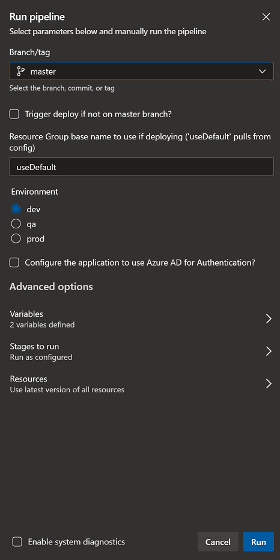
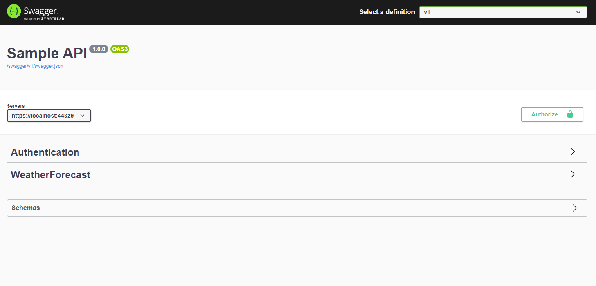
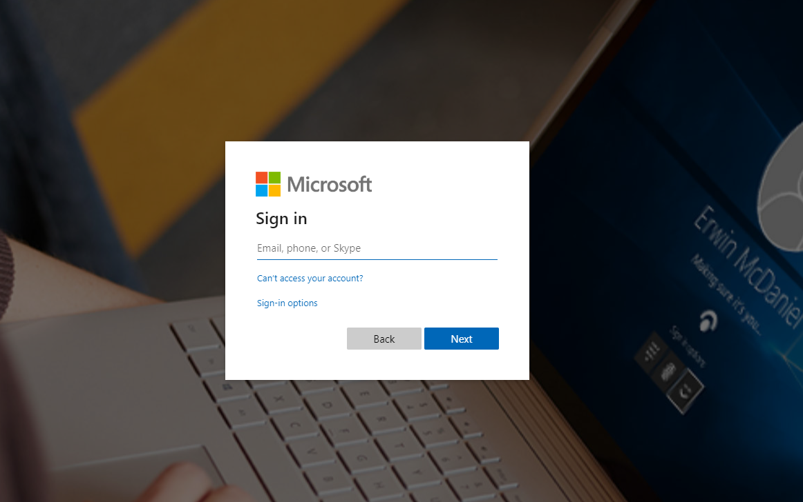
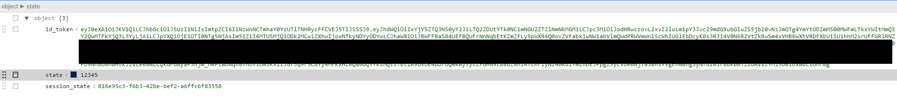
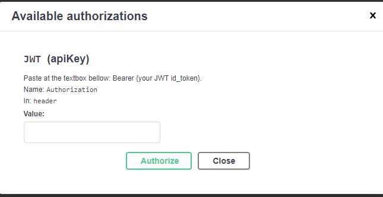

# Authentication using Azure Active Directory

To add Azure Active Directory Authentication to your deployment follow the following steps:

## 1 - Create Azure Active Directory Application

To use the Authentication it is necessary to create an application on Azure Active Directory that will represent the Server.

You can create the application using the portal or running the shell script available at the folder ./scripts

To know more about the configuration the script is doing check this article [Protect an API by using OAuth 2.0 with Azure Active Directory and API Management][azure-ad-sample]

The script is going to use the AZ CLI current context, so before running the script check if you are logged in and using the correct subscription.

``` bash
#shows the details of the default subscription
az account show

#shows all the subscriptions available
az account list -o table

#if you need to change the current subscription
az account set -s <subscription id>
```

To create the application execute the following command

``` bash
cd scripts

./CreateAzureAdApp.sh --app-name=sample
```

- --app-name: Is the name of the application that will be created.

The script is going to create an application defining two different URIs as redirect URI:

- "https://localhost:44329/login"
- "https://*.azurewebsites.net/login"

The first one for development the app will load the configuration from **appsettings.Development.json** at the **Authentication->AzureActiveDirectory->ReplyUri**. If you decide to change this value is necessary to update the AAD Application as well.

the second is going to be used in production when deployed to Azure, the script is using wildcard as the application is going to be created before the pipeline runs.

Check the article [Redirect URI/reply URL restrictions and limitations][azure-ad-redirect-uri] to know more about the limitations.

## 2 - Creating the variable group

After executing the script you will ge the following result:

``` bash
-------------APPLICATION-------------------
MANIFEST_FILE     :app-manifest.json
TENANT_ID         :<Guid the tenant>
DOMAIN            :xxxx.onmicrosoft.com
APP_NAME          :<App name>
OBJECT_ID         :<Application Object Id>
CLIENT_ID         :<Generated Application ID>
CLIENT_SECRET     :<Application Password>
```

This values will be used by the Azure Pipeline (CD) when creating the Azure infrastructure (Azure Key Vault)

To avoid storing the values at the YAML files we will use a Variable Group, check the article [How to create a variable group][how-create-variable-group]

To use the provided Yaml without any changes use the following configuration

Variable group name: **sample-template-authentication**

And add the variables:

- ServerTenantId: **GUID for you Azure AD Tenant**
- ServerDomain: **your Azure AD Domain something like xxxx.onmicrosoft.com**
- ServerClientId: **Client ID returned by the script at the server section**
- Authority: **<https://login.microsoftonline.com/{ServerTenantId}/v2.0>** this is token issuer we want to validate, depending of the access token version it changes v2 uses this format v1  uses **<https://sts.windows.net/{ServerTenantId}/>**

## 3 - Executing the Azure Pipeline

At this point you already have a pipeline created using the yaml file **azure-pipelines/build-test-deploy.yaml**, if you don't have it check this article [Create your first pipeline][Create-first-pipeline]

The pipeline uses parameters to customize its behavior.



Define the name of the resource group, choose the Environment you want to use and check the option "Configure the application to use Azure AD for Authentication?"

After customizing click over the button "Run" at the bottom, the application is going to be built and tested before being deployed.

After finishing you can open the browser and type: **<https://resource-group-name+environment.azurewebsites.net>**

You will see the swagger UI



If you try to execute any of the endpoints available you will get a 401 http error code, because we are not providing the bearer token to access the service.

## 4 - Generating the Token

To generate a valid token we have to access the login endpoint **<https:service-url/login>**, you will be redirected to the Azure Active Directory login page. Remember that depending of your environment the service-url is going to change.



Azure Active Directory provides different authentication flows depending of the client needs. For this example we are going to use the [OpenId Connect Flow][openId-connect-flow]. To know more about the others flows, check this article [Application types for Microsoft identity platform][application-types-microsoft-identity]

After you have provided the correct credentials to access your account you are going to be redirected to the login endpoint showing the id_token information.



The id_token is a JWT (Json Web Toke) it's can verify it's content accessing the [JWT.ms][JWT-ms]. Copy the field id_token from the json and paste it.

## 5 - Updating SwaggerUI with the token

To use SwaggerUI and try the endpoints we need to Authorize the SwaggerIU saving the token to the current session. To do that you have to click over the button "Authorize", at the top right corner, a pop-up is going to be presented to allowing you to save the token.



At the textbox type **Bearer** and paste the token.

You are going to have something like this.

**Bearer yJ0eXAiOiJKV1QiLCJhbGciOiJSUzI1NiIsImtpZCI6IlNzWnNCTmhaY0YzUTlTNHRycFFCVEJ5TlJSSSJ9.eyJhdWQiOiIxYjY5ZTQ3NS0yY2JiLTQ2.....**

Click over Authorize to save it, and now you can try to retrieve the claims for instance

[azure-ad-sample]: https://docs.microsoft.com/en-us/azure/api-management/api-management-howto-protect-backend-with-aad
[azure-ad-redirect-uri]: https://docs.microsoft.com/en-us/azure/active-directory/develop/reply-url
[how-create-variable-group]: https://docs.microsoft.com/en-us/azure/devops/pipelines/library/variable-groups?view=azure-devops&tabs=classic#create-a-variable-group
[Create-first-pipeline]: https://docs.microsoft.com/en-us/azure/devops/pipelines/create-first-pipeline?view=azure-devops&tabs=net%2Cyaml%2Cbrowser%2Ctfs-2018-2
[openId-connect-flow]: https://docs.microsoft.com/en-us/azure/active-directory/develop/v2-protocols-oidc
[application-types-microsoft-identity]: https://docs.microsoft.com/en-us/azure/active-directory/develop/v2-app-types
[JWT-ms]: https://jwt.ms
